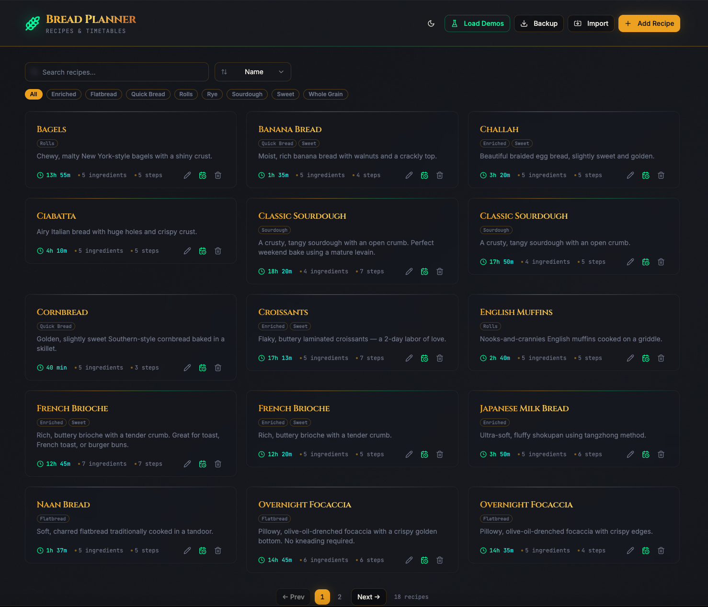
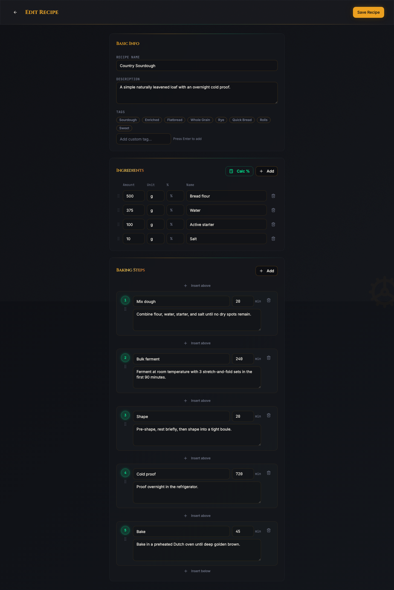
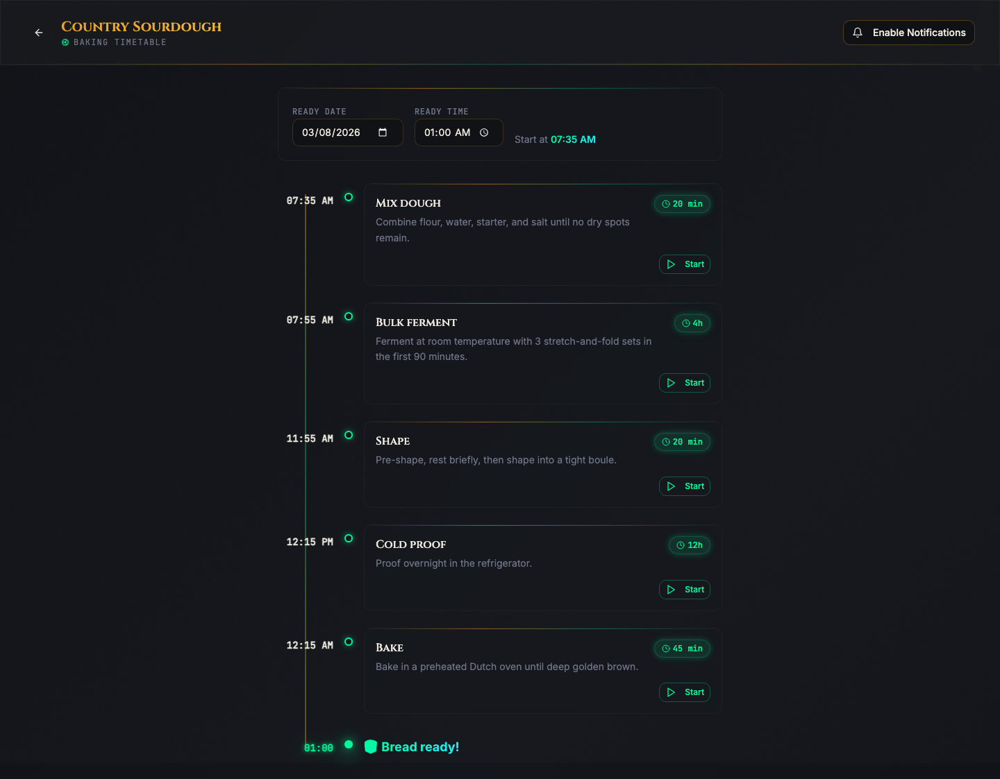
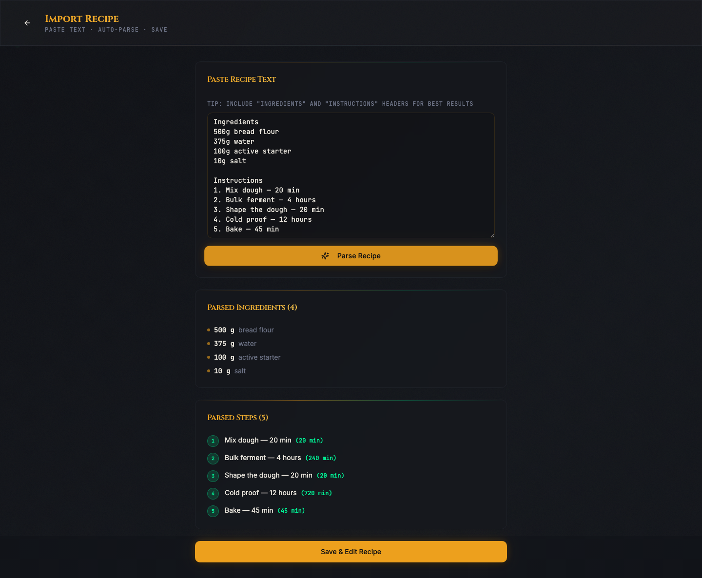

# Dough Planner Plus

Dough Planner Plus is a local-first baking planner for bread recipes.

It covers the full path from rough recipe intake to a structured baking workflow:

- store and search recipes locally
- edit ingredients and timed baking steps
- import recipes from pasted text or URLs
- review and refine imported drafts before saving
- generate a backward-planned timetable from a target ready time

## Features

- recipe library with search and quick actions
- recipe editor for ingredients, baker's percentages, tags, and timed steps
- backward-planned baking timetable based on the target ready date and time
- recipe import with two input modes: pasted text and recipe URLs
- AI-assisted structured extraction using the OpenAI Responses API through the Vercel AI SDK
- JSON-LD recipe extraction for sites that publish `schema.org/Recipe` data
- quick local parse fallback for offline-friendly or failure-tolerant text import
- editable import preview for recipe name, description, tags, ingredients, and steps
- local-first persistence in browser `localStorage`
- responsive React UI built with shadcn/ui and Tailwind CSS
- installable PWA support

## Screenshots

### Recipe library



### Recipe editor



### Baking timetable



### Recipe import



## Tech stack

- Vite
- React 18
- TypeScript
- Tailwind CSS
- shadcn/ui
- React Router
- TanStack Query
- Vercel AI SDK (`ai`, `@ai-sdk/openai`)
- Zod
- Vitest

## Requirements

- Node.js
- npm
- `OPENAI_API_KEY` for AI import

## Installation

```sh
git clone <YOUR_GITHUB_REPO_URL>
cd dough-planner-plus
npm install
cp .env.example .env
```

Set `OPENAI_API_KEY` in `.env`. The optional `OPENAI_RECIPE_IMPORT_MODEL` variable selects the OpenAI model used for recipe extraction and defaults to `gpt-4.1-mini`.

## Commands

```sh
npm run dev
```

Starts the Vite development server on port `8080` by default. The `/api/recipe-import` endpoint is served in development through a Vite middleware plugin.

```sh
npm run build
```

Builds the production client bundle.

```sh
npm run build:dev
```

Builds the client bundle using the development mode Vite configuration.

```sh
npm run preview
```

Serves the production build locally.

```sh
npm run test
```

Runs the Vitest suite once.

```sh
npm run test:watch
```

Runs Vitest in watch mode.

```sh
npm run lint
```

Runs ESLint across the repository.

## Environment

The repository includes [.env.example](.env.example):

```env
OPENAI_API_KEY=your_openai_api_key
OPENAI_RECIPE_IMPORT_MODEL=gpt-4.1-mini
```

`OPENAI_API_KEY` is read only on the server-side import path. The browser never calls OpenAI directly.

## Import flow

Recipe import is available at `/import` and supports two modes:

- `Text`: paste recipe text and choose `Import with AI` or `Quick Parse`
- `URL`: provide a recipe page URL and import it through the server route

The server import contract is:

`POST /api/recipe-import`

Request body:

```json
{ "mode": "text", "text": "..." }
```

or

```json
{ "mode": "url", "url": "https://example.com/recipe" }
```

Response body:

```json
{
  "recipe": {
    "name": "Pan Bread",
    "description": "",
    "tags": ["Flatbread"],
    "ingredients": [{ "name": "Flour", "amount": "500", "unit": "g" }],
    "steps": [{ "name": "Bake", "durationMinutes": 25, "instructions": "Bake until golden." }],
    "warnings": []
  },
  "source": "jsonld",
  "warnings": []
}
```

Import precedence:

1. validate the request
2. for URL imports, fetch the recipe page server-side
3. extract `schema.org/Recipe` JSON-LD when available
4. fall back to AI extraction with a schema-constrained response
5. fall back to quick local parse when AI extraction is unavailable or unusable
6. present the normalized draft for editing and save it locally

## Data model and storage

Recipes are stored in browser `localStorage` under the `bread-planner-recipes` key.

That means:

- saved recipes stay on the device unless exported manually
- no backend database is required for recipe storage
- clearing browser storage removes saved recipes

The AI import pipeline uses a small server boundary for URL fetching and OpenAI calls, while the saved recipe library remains local-first.

## Project structure

```text
api/
  recipe-import.ts          Production server entrypoint for recipe import
server/
  lib/                      Server-side import pipeline helpers
src/
  components/               UI building blocks
  lib/import/               Shared import schema, normalization, and quick parse helpers
  lib/                      Storage and client utilities
  pages/                    Route-level screens
  test/import/              Import-focused tests
  test/                     Test setup and general tests
  types/                    Shared TypeScript types
docs/
  ai-recipe-import-plan.md  Import architecture and implementation reference
  prompt.md                 Product brief and scope
  screenshots/              README screenshots
```

## Deployment notes

Development uses the Vite middleware plugin in [server/vite-recipe-import-plugin.ts](server/vite-recipe-import-plugin.ts) to expose `/api/recipe-import`.

Production expects a runtime that can serve [api/recipe-import.ts](api/recipe-import.ts) as an HTTP endpoint and provide `OPENAI_API_KEY` in the server environment.

## Testing

The repository includes targeted tests for:

- quick parse behavior
- import normalization
- JSON-LD recipe extraction
- general test setup

Run all tests with `npm run test`.

## Scope

Dough Planner Plus is a focused bread-planning application:

- no user accounts
- no backend recipe database
- no cloud sync

The primary workflow is local recipe planning, with a server-side import boundary for AI-assisted recipe structuring.
